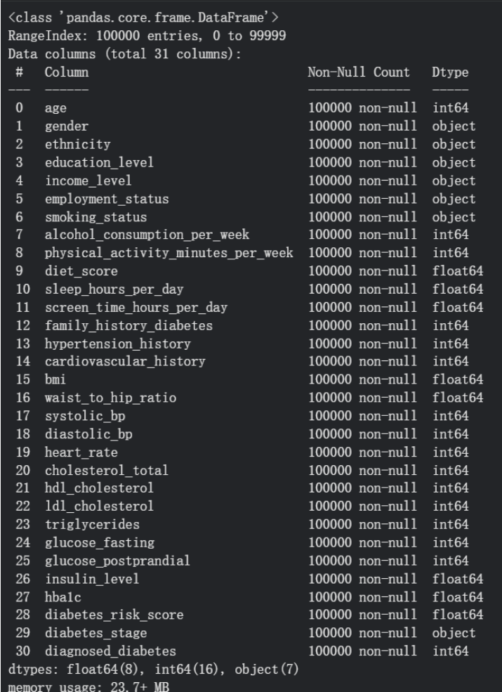
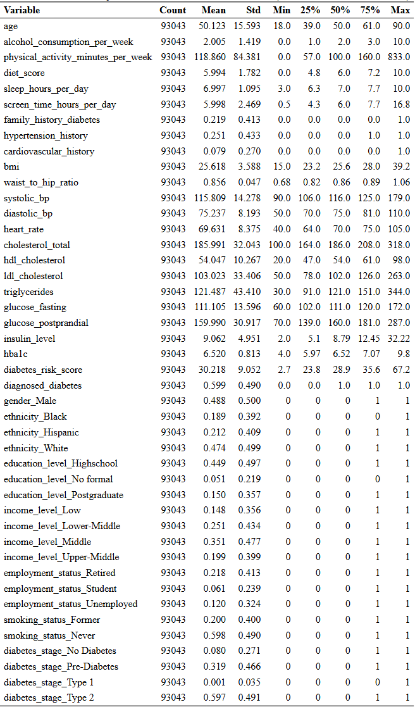
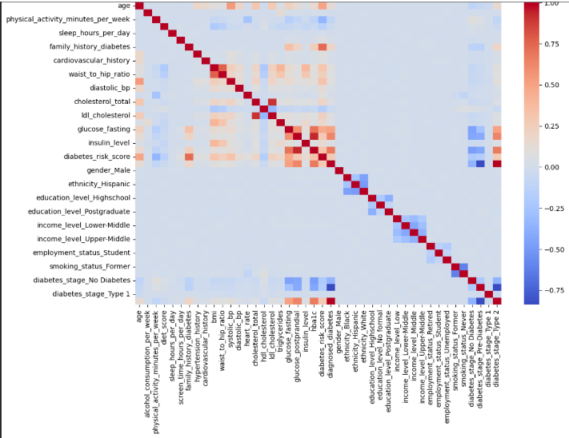
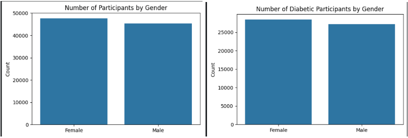
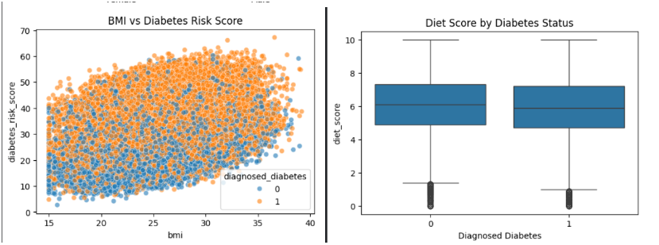
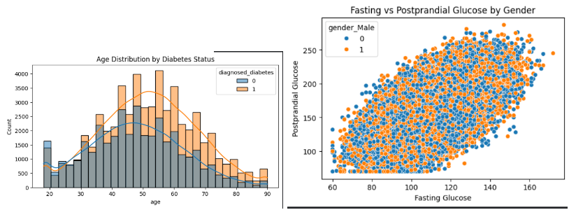
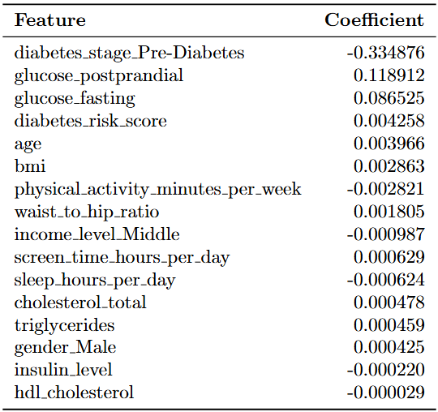
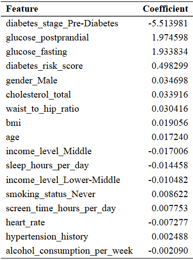
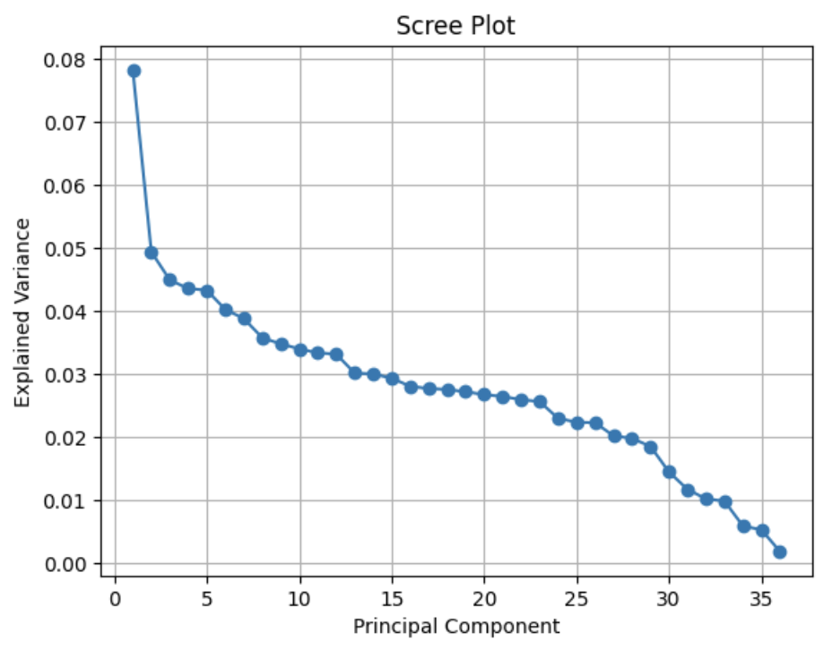

# risky_bets

*m148 final project*

  
  

### i. Description of Dataset

**Dataset name:** Diabetes Health Indicators Dataset  

**Source:** Kaggle [link](https://www.kaggle.com/datasets/mohankrishnathalla/diabetes-health-indicators-dataset/data)  

**Rows:** 100,000 patients  

**Columns:** ~31 features  

**File:** `diabetes_dataset.csv`  

  

**Brief summary:**  This dataset contains 100,000 synthetic but clinically realistic patient profiles modeled after survey patterns from the CDC and medical research. It includes demographic, lifestyle, biometric, and laboratory features used to predict diabetes status, with no missing values and a moderately balanced target distribution. Because many indicators resemble real-world risk factors (such as blood pressure, cholesterol, physical activity, BMI, and education), the dataset is well suited for our health-focused machine learning model's predictive accuracy and interpretability.

  
  

---

### ii. Project Idea

Diabetes is a chronic metabolic disease that affects millions of individuals’ lives worldwide. Early identification of individuals at high risk is crucial for prevention, timely intervention, and reducing long-term health complications.

Given demographic information, medical history, and lifestyle behavior features, the goal is to predict whether an individual has diabetes. The central goal of this study is to evaluate whether modern neural network models outperform traditional machine learning approaches, such as linear regression, logistic regression, K-nearest neighbors (KNN), decision trees, and random forests, in predicting diabetes. Understanding these performance differences provides insight into the appropriate modeling strategy for structured health data and informs decisions on model deployment in real-world public health or clinical environments.

  
  

---

### iii. Key Methodology

To predict diabetes, we implemented supervised learning models such as linear regression, logistic regression, KNN, and Random Forests, as well as unsupervised learning models, including PCA with clustering and Neural Networks. 

For linear regression, we applied two regularization methods to reduce overfitting: L2 regularization (Ridge) and L1 regularization (L1). We compared which penalty helps the model generalize better.

For predicting the probability of diabetes, we used logistic regression. Logistic regression is well-suited to this kind of binary classification problem. We applied regularization to control overfitting and improve generalization. We used logistic regression as the baseline to compare other models.

To capture nonlinear decision boundaries, we used kNN and evaluated multiple k values to optimize the bias-variance trade-off. Smaller k-values showed signs of overfitting while larger ones underfitted.

Random Forest was used to capture nonlinear relationships and feature interactions. It is an ensemble method composed of many decision trees that reduce variance with bagging, so it is less prone to overfitting than a single decision tree because multiple trees are averaged. 

PCA was used for dimension reduction to focus on the most important features/components, as some were collinear. In the reduced feature space, we applied clustering methods to identify natural patterns in diabetes risk and gain insight into the dataset's structure.

For Neural Networks, we used them to model complex nonlinear relationships to predict diabetes. It required tuning parameters such as the learning rate, number of epochs, and batch size to prevent overfitting.

  
  
  
  

---

### iv. Results

  
  
  
  

---

### v. How To Run the Code

To run the code, download the Jupyter Notebook `final-project.iypnb`, open it in Google Colab, upload the dataset as `diabetes_dataset.csv` and run the notebook cell by cell from top to bottom. The notebook automatically performs necessary preprocessing steps, trains all models, and evaluates each of its performance. The user can adjust hyperparameters--learning rate, epochs, batch size, k-values, alphas, etc.--by modifying the corresponding cells and rerun the cells associated with the specific model.

  
  
  
  

---

---

## ***Appendix***

  

### i. Explain the exploratory data analysis that you conducted. What was done to visualize your data and split your data for training and testing?

First, apply info function to request general information about the dataset.

There are 31 columns and 100000 rows, which means that there are 100000 individuals and
30 predictors after excluding `diagnoseddiabetes` column. All 31 columns are complete, with
no missing values, and each column contains exactly 100000 non-null entries. The entries
have `int`, `object`, `float` types. Therefore, it is necessary to apply on-hot encoding to transform
categorical data into numerical data. This structure provides a clean and comprehensive basis
for downstream analysis and modeling.
  
Second, since some of the datatypes are object, it is necessary to perform on-hot encoding. Step
one is to delete individuals who answer ”other” in Gender and Ethnicity. The next step is to
divide answers into different predictors.

Apply describe function to request numerical details of each predictors.

<strong>Table 1: Summary Statistics of All Variables (Numerical + One-hot)</strong>

Observing the distribution of the target variable, it is found that nearly 60% of the individuals
are diagnosed as diabetes. The target variable `Diabetes` is highly balanced, which is good for
model training and evaluation. There is no obvious majority of non-diabetes and diabetes. If a
model only considers the majority class, it might always predict 0 (non-diabetic), but failing to
capture true positive cases, making it practically useless for prediction. Metrics like precision,
recall, F1-score, and ROC-AUC are more appropriate to judge the accuracy of the models based
on this dataset.

Third, investigating collinearity of the predictors in order to delete super similar predictors. The
following graph is the visualization of collinearity matrix:

Select predictors that are highly correlated with a threshold over 0.9 in absolute value. Predictors such as `ldl_cholesterol`, and `hba1c` are deleted in order to
simplify the data.

Furthermore, we remove `diabetes_risk_score`, `diabetes_stage_No Diabetes`, `diabetes_stage_Pre-Diabetes`, `diabetes_stage_Type 1`, and `diabetes_stage_Type 2` from the training data, as these varables are associated with `diagnosed_diabetes`. 

<strong>Data Visualizations</strong>

Figure 1: Left: Gender Count. Right: Diabetes Count by Gender.

Figure 2: Left: BMI vs Diabetes Risk Score. Right: Diet Score by Diabetes Status.

Figure 3: Left: Age Distribution by Diabetes Status. Right: Fasting vs Postprandial Glucose
by Gender.

After these EDA processes, we split the dataset randomly into 80% training dataset and 20%
testing dataset. Their names are `X_train` for the independent variable training set, `X_test`
for the independent variable testing set, `y_train` for the dependent variable training set, and
`y_test` for the dependent variable testing set

### ii. What data pre-processing and feature engineering (or data augmentation) did you complete on your project?

In EDA analysis section, one-hot encoding and finding collinearity have been done. Them,
dealing with outliers and preparing normalized data.
  

### iii. How was regression analysis applied in your project? What did you learn about your data set from this analysis and were you able to use this analysis for feature importance? Was regularization needed?

Predicting whether an individual has diabetes is a binary judgement, which means a diabetes
score parameter is needed to imply how likely it is for an individual to has diabetes. And the
threshold is set to be 0.5. Since there are over 30 predictors for regression, it was decided that
Lasso Regression is the main method performed for Regression Analysis because it eliminates
unimportant predictors by punishing their coefficients into 0.

The dataset was first split into training (80%) and testing (20%) sets, and all predictors were
normalized to ensure comparability of coefficients. A 5-fold cross-validation procedure was
applied to select the optimal regularization parameter α and to prevent overfitting. The Lasso
regression model can be expressed as:

$$
\hat{\beta} = \arg\min_{\beta} \left( 
  \frac{1}{2n} \sum_{j=1}^{n} \left( y_j - \beta_0 - \sum_{i=1}^{p} \beta_i X_{ij} \right)^2 + \lambda \sum_{i=1}^{p} |\beta_i|
\right)
$$

`diabetes_score`: 

$$
\beta_0 + \sum_{i=1}^{p} \beta_i X_i
$$

where $\beta_i$ represents the coefficient for predictor $X_i$.

  
The coefficients of the well-performed model are:

<strong>Table 2: Lasso Regression Coefficients for Diabetes Prediction</strong>

Other features, such as age, BMI, waist-to-hip ratio, and physical activity, had smaller but
nonzero coefficients. Many categorical variables (e.g., education level, employment status,
ethnicity) were shrunk to zero by Lasso, indicating lower predictive importance.

The best α found by cross-validation was `0.000655`, and the cross-validated `R^2` score on
the training set was approximately `0.822`. It seems that Regulation is needed for the regression
prediction.

### iv. How was logistic regression analysis applied in your project? What did you learn about your data set from this analysis and were you able to use this analysis for feature importance? Was regularization needed?

Predicting whether an individual has diabetes is a binary classification problem. A logistic regression model was applied to estimate the probability of diabetes for each individual. The
threshold for classification was set at 0.5. Since there are over 30 predictors, L1-regularized
logistic regression (Lasso) was chosen to perform feature selection by shrinking unimportant
coefficients to zero.

The dataset was split into training (80%) and testing (20%) sets, and all predictors were standardized to have zero mean and unit variance. A 5-fold cross-validation procedure was applied
to select the optimal inverse regularization strength `C` and to prevent overfitting. The logistic
regression model can be expressed as:

$$
P(Y = 1 \mid X) = \frac{1}{1 + \exp\!\left( -\left( \beta_0 + \sum_{i=1}^{p} \beta_i X_i \right) \right)}
$$

where $\beta_i$ represents the coefficient for predictor $X_i$, and $P(Y = 1 \mid X)$ is the probability that an individual has diabetes.

  
The coefficients of the well-performed model are:

<strong>Table 3: Logistic Regression Coefficients for Diabetes Prediction</strong>

Many predictors, such as physical activity, diet score, family history of diabetes, and categorical variables like education level, ethnicity, and employment status, were shrunk to zero by L1
regularization, indicating low predictive importance.

The best `C` (inverse of regularization strength) found by cross-validation was approximately
`0.046`, and the training accuracy was `0.969`. The model achieved a test accuracy of `0.968`. The
confusion matrix and classification report are shown below:

$$
\text{Confusion Matrix} =
\begin{bmatrix}
7171 & 288 \\
300  & 10850
\end{bmatrix}
$$

Classification report:
- **Class 0 (No Diabetes)**: precision = 0.96, recall = 0.96, F1-score = 0.96
- **Class 1 (Diabetes)**: precision = 0.97, recall = 0.97, F1-score = 0.97
- **Overall Accuracy**: 0.97

### v. How were KNN, decision trees, or random forest used for classification on your data? What method worked best for your data and why was it good for the problem you were addressing?

***Table.** Test-set performance of non-linear classification models for predicting diagnosed diabetes.*

| Model           | Accuracy | Precision | Recall | F1 |
|-----------------|----------|-----------|--------|----|
| Random Forest   | 0.845    | 0.901     | 0.832  | 0.866 |
| Decision Tree   | 0.837    | 0.897     | 0.821  | 0.858 |
| KNN (k = 15)    | 0.787    | 0.812     | 0.839  | 0.825 |

We applied K-nearest neighbors (KNN), decision trees, and random forest classifiers to predict diagnosed diabetes using the processed feature set. These models were chosen because they can capture non-linear relationships between demographic, lifestyle, and clinical variables.

KNN was trained on standardized features since it is distance-based. We evaluated several values of k (5, 15, and 25) and observed that increasing k reduced the variance of predicted probabilities without substantially changing their central tendency. Based on this bias–variance tradeoff, we selected k = 15. As shown in the table above, KNN achieved a test accuracy of 0.787 and an F1-score of 0.825, making it the weakest performer among the three models.

Decision trees were trained on the cleaned but unscaled feature set. To reduce overfitting, we limited the maximum tree depth and required a minimum number of samples per leaf. This model improved performance over KNN, achieving a test accuracy of 0.837 and an F1-score of 0.858, while maintaining interpretability.

Random forest classification further improved performance by aggregating predictions from many decision trees. This ensemble approach reduced variance and better captured complex feature interactions. As shown in the table above, the random forest achieved the highest test accuracy (0.845) and F1-score (0.866) among all evaluated methods, making it the best-performing non-linear classifier in this analysis.

Overall random forests were most effective for this task because they balance flexibility and generalization in high-dimensional, structured health data. KNN provided a useful baseline for local similarity-based classification, while decision trees served as an interpretable intermediate model.

### vi. How were PCA and clustering applied on your data? What method worked best for your data and why was it good for the problem you were addressing?

We applied PCA to standardized data mainly to understand which variables contributed most to variation in the dataset and to visualize the data in a lower-dimensional space. The scree plot did not show a clear elbow, suggesting that variance was spread across many components and that our dataset was not well suited for aggressive dimensionality reduction using PCA.

  
   
  <em>Figure VI.1 Scree plot showing explained variance by principal component.</em>

By examining the PCA loadings, we found that PC1 was largely driven by body metrics such as BMI and waist-to-hip ratio, PC2 was dominated by glucose measurements, and PC3 was related to smoking status. PCA was also used to visualize the data and clustering structure in three dimensions.

K-means Clustering was evaluated using diabetes stage rather than diagnosed diabetes because diabetes stage has four categories, which aligns more naturally with a multi-cluster setting than a binary outcome. When clustering was performed on the full dataset, agreement with diabetes stage was very low (adjusted rand index, ARI ≈ 0.01). However, restricting clustering to PCA-identified, clinically relevant features (bmi, waist to hip ratio, glucose levels) improved agreement (ARI ≈ 0.15).

Overall, PCA was most effective for feature identification and visualization, while clustering on targeted feature subsets was more appropriate for evaluating alignment with diabetes stage.

### vii. Explain how your project attempted to use a neural network on the data and the results of that attempt.

Using PyTorch, we implemented a Multilayer Perceptron to evaluate improvement in diabetes prediction. 
The neural network had the following architecture: 
- an input layer dimension= total number of features =36,
- a first hidden layer with 64 neurons and ReLU activation applied to it,
- a second hidden layer with 32 neurons and ReLU activation applied to it, and an
- Output Layer with 1 neuron
to produce a logit for the binary classification (yes or no) for diabetes.

We trained the model using BCELogitsLoss function and the Adam optimizer and used mini-batch gradient descent as it seemed it would work better than batch descent which is typically used for larger datasets. We split the dataset into train, validation, and test sets and selected mode based on performance from the validation set. We experimented with learning rates, batch sizes, and number of epochs to get the best performance configuration: 
- learning rate 1e-2,
- 15 epochs, Adam optimizer,
- batch size 32.

This configuration yielded validation accuracy of 83.49%, validation loss of 0.3659%, test accuracy of 83.60% and test loss of 0.3639%. The Validation and Test losses were the lowest of all the combinations we tried. Training fewer than 15 epochs like 12 epochs resulted in slight underfitting while training for 20-25 epochs increased validation and test loss as training loss which indicated overfitting. The Neural Network did not seem to significantly outperform the other models used. Logistic Regression seems to be the best model for predicting diabetes.

### viii. Give examples of hyperparameter tuning that you applied in preparing your project and how you chose the best parameters for models.

We performed hyperparameter tuning for the Neural Network
For tuning the learning rate, we tried: 
- 1e-2
- 1e-3
- 1e-4

**Results**
- lr=1e-2 produced best validation and test loss. 
- lr=le-3 significantly overfitted high test and validation loss but training loss lowered 
- lr=1e-4 the model learned too slowly and underperformed.

For tuning the epochs, we tried:
- 12
- 15
- 20
- 25

**Results**
- 12 epochs showed signs of slight underfitting with higher validation loss. 
- 15 epochs had the best validation and test performance. 
- 20 and 25 epochs indicated heavy overfitting.

For tuning batch size, we tried:
- 32
- 64

**Results**

a batch size of 64 with lr=1e-2 and epochs=15 resulted in unstable validation and test losses, jumps from .34 to .47 for validation loss even though the accuracy and training losses were lower on some runs so batch size of 32 seemed ideal.

For KNN,

We tuned for k. 

- 15
- 20
- 25

**Results**

Changes in k-values do not significantly shift the central tendency of predictions, as the median sits close to .6 for k=5, 15, and 25.

Variance decreases as k increases, so a smaller k value, like 5, is more prone to overfitting, and a larger value, such as k, is more prone to underfitting. k=15 has a more balanced bias/variance and smoother predictions; it is the better-performing of the three k values.

For Linear regression,

We tuned the alphas to adjust the strengths of the L1 and L2 penalties for Lasso and Ridge, respectively.

**Results**
We searched over 50 possible alpha regularization values ranging from 10^-4 to 10, then used 5-fold cross-validation to select the optimal alpha value that minimized cross-validation error.
